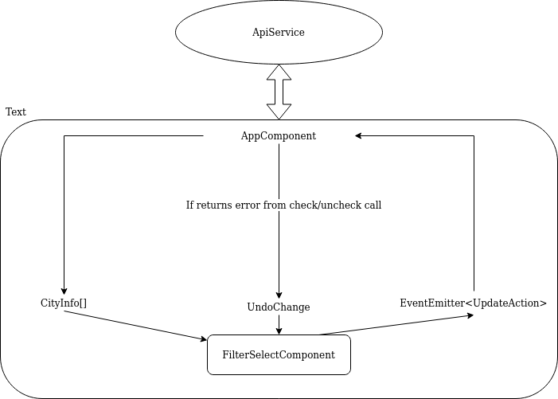

# FrontendChallenge

This project was generated with [Angular CLI](https://github.com/angular/angular-cli) version 8.3.22.

## Development server

Run `./api-server` for running the api. Then, run `ng serve` for a dev server. Navigate to `http://localhost:4200/`. The app will automatically reload if you change any of the source files.

## Introduction

This is an user interface to pick cities from a long list of the major cities in the world. There is a filter to find the city you want and after checking it will be listed at the top.

## Development
In this development I have a parent component (app.component) that is in charge of making calls to the service in charge of communicating with the API and a child component that is in charge of the list and check logic to inform the parent about the modifications made.

The child component (filter-select.component) receives as input all the cities that had been requested from the '/cities' endpoint. Then, internally it reads the value that the user writes in the input to filter the cities to show in the list below.

My strategy related to how to handle the selection of cities is as follows is made with optimistic updates. If the user marks a city, it is added to the list of selected cities at the top. Simultaneously, the component through an output sends the modification to its parent component, which is the one that will send the modification through a patch to '/preferences/cities'. This is known as an optimistic update

In an optimistic update the UI behaves as though a change was successfully completed before receiving confirmation from the server that it actually was - it is being optimistic that it will eventually get the confirmation rather than an error. This allows for a more responsive user experience.
On the other hand, if the call returns an error, the user must be notified and the selection of the city must be undone. It is a trade off between transmitting instantaneously to the user when checking a city and facing having to restore a failed modification.

As an improvement for development, I made it possible to uncheck a city directly from where the selected cities are listed, so that the user does not have to search one by one again for the cities that he wants to uncheck.

